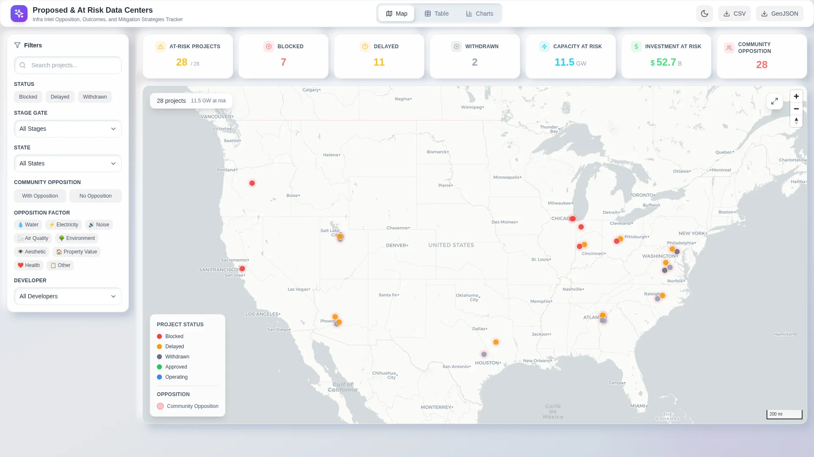
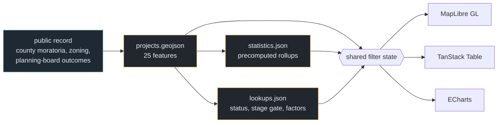

# Data Center Graveyard Dashboard

A map, table and chart interface over 25 US data-centre projects that were
blocked, delayed or withdrawn — 9.8 GW, $60.2 bn and 5,260 acres of development
that did not proceed as planned. Each project carries the stage it died at, the
county, and the specific community objections raised against it, tagged across
eight recurring factors. MapLibre GL, Apache ECharts, TanStack Table; static
build, no backend.

Built to ask a siting question the usual pipeline trackers cannot: not *where is
capacity being built*, but *where did it stop, and what stopped it*. Twenty-one of
the twenty-five faced organised community opposition.



*Placeholder still. Map, filters and charts are interactive — a demo GIF replaces this.*

**Live → [dc-graveyard-dashboard.vercel.app](https://dc-graveyard-dashboard.vercel.app/)**

---

## What the data says

| | |
|---|---|
| Projects | 25 across 10 states |
| Capacity that did not proceed | 9.8 GW |
| Announced investment | $60.2 bn |
| Land | 5,260 acres |
| Faced organised opposition | **21 of 25** |
| Blocked · delayed · withdrawn | 7 · 11 · 7 |

**Where projects die, by stage gate:**

| Stage | Count |
|---|---|
| Planning / land-use review | 16 |
| Legislative / zoning | 7 |
| Legal / litigation | 2 |

The finding worth stating: **projects overwhelmingly fail at planning and land-use
review, not in court.** Sixteen of twenty-five never reached a legislative vote,
and only two ended in litigation. Opposition is effective early and cheap; by the
time a project is being litigated, most of the ones that were going to fail
already have.

**Objections, by factor:** Aesthetic · Electricity · Environment · Health · Noise ·
Other · Property Value · Water. Projects usually carry several — `opposition_count`
records how many, which is what makes "contested" a scale rather than a flag.

**The detail that would have made it wrong:** *this dataset is survivorship in
reverse.* It contains only projects that failed visibly enough to be recorded. A
project quietly abandoned before announcement is not here, so the counts are a
floor, and "21 of 25 faced opposition" says something about *recorded* failures,
not about the base rate of opposition across all proposals.

---

## Data provenance

**Real public events, anonymised actors.** The locations and regulatory outcomes
are drawn from public record — county moratoria, zoning decisions, planning-board
outcomes in places like Loudoun County VA, Prince William County VA and Chandler
AZ. What has been generalised is the *who*: developers and tenants read as
"Multiple Developers", "Unknown Developer" or "Large Cloud Provider" rather than
naming parties.

This is deliberate. The public interest is in where and why projects fail; naming
a specific developer in a dataset about failure invites a dispute that adds nothing
to the analysis.

---

## Architecture



The important edge: **`opposition_factors` is an array on the feature, not a
category.** A project objected to on noise, electricity and property value is one
project appearing in three factor counts — so the factor chart intentionally sums
to more than 25, and the code does not pretend otherwise.

---

## Quickstart

```bash
npm install
npm run dev
```

```bash
npm run build
```

Static output, no keys, no backend.

---

## Using it

- **Filter by opposition factor and the map redraws to that grievance.** Water
  objections cluster differently from electricity objections, which is the sort of
  thing a table cannot show you.
- **Stage gate is the most useful axis**, because it answers "how far did this get
  before it stopped" rather than merely "did it stop".
- **`community_detail` carries the specific objection text** for a project, which
  is what keeps a factor tag from flattening into a category.

---

## Project layout

```
public/data/
  projects.geojson   25 features; status, stage gate, capacity, cost, acreage,
                     opposition factors and count, community detail
  statistics.json    precomputed rollups by status, stage gate, state, factor
  lookups.json       controlled vocabularies for each filter
src/                 React app — map, table, charts, shared filter state
```

---

## Limits

**Twenty-five projects is a small n.** Every percentage in here is over a
two-digit denominator. Treat the stage-gate distribution as a shape, not an
estimate.

**Selection bias, stated above**, is the main limit and it is structural rather
than fixable: a graveyard only holds what got buried.

**Costs and capacities are announced figures**, not audited ones — the numbers
developers published at proposal, which are exactly the numbers most likely to be
optimistic.

**Static snapshot**, generated 2026-04-03. Several of these projects have moved
since.

---

## Stack

React · MapLibre GL JS · Apache ECharts · TanStack Table · Vite. Deployed on Vercel.
